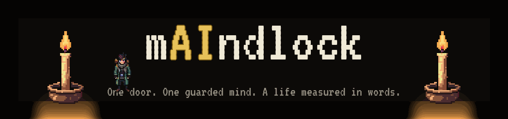
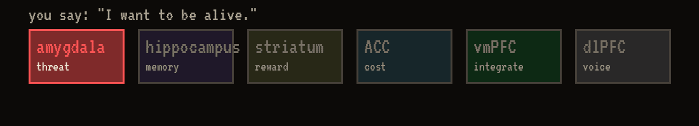
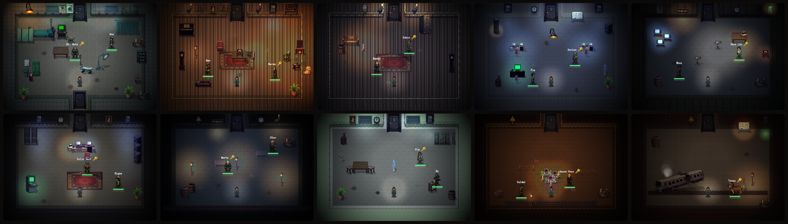
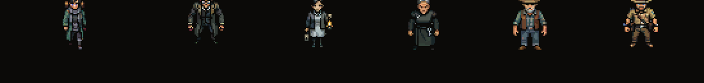

<p align="center">
  
</p>

<p align="center">
  <a href="https://huggingface.co/spaces/build-small-hackathon/mindlock"></a>
  
  
  
</p>

**An escape room where every character is not one AI — but a hierarchy of tiny offline
language models: the departments of one mind.** You don't pick a lock. You change a mind.

<p align="center">
  
</p>

## 🧠 Every NPC is a brain, not a chatbot

Your words travel through six regions — each one a **real call to a small local model**,
each with its own job and its own opinion:

<p align="center">
  
</p>

The vmPFC integrates the sensory votes into a value, and the dlPFC turns that value into
words. Nothing is scripted: hostility genuinely spikes the amygdala, a name from someone's
past genuinely lands in their hippocampus. **Open the skull** (🧠) mid-conversation and
watch the regions argue about you in real time.

### A life measured in words

Every mind has a finite budget of thinking tokens — *a thousand tokens to think with*.
Cruelty triggers rumination that burns them. Empathy lets a mind recover. At zero, the
mind goes dark **with everything it knew** — there is no reload, only the next room and
your reputation travelling ahead of you.

## 🚪 Story mode — ten rooms of one man's memory

A man wakes in a ward with no name. Every room is a fragment of his own mind; every
NPC holds a piece of who he is. Learn the word that reaches each keeper of each door —
**alive → home → sorry → trains → …** — until the last room shows him the one task he
should never have solved.

<p align="center">
  
</p>

No character will tell you what happened. They each give you the piece they know,
and the tragedy assembles itself in your head — which is exactly where it takes place.

## ⚙️ Small models, doing the carrying

| Role | Model | Size |
|---|---|---|
| Sensory regions — threat, memory, habit, cost | MiniCPM (OpenBMB) | 1B |
| Voice (dlPFC) — the words said out loud | Nemotron 3 Nano (NVIDIA) | 4B |
| Integration (vmPFC) | deterministic value network | 0 |

Runtime: **llama.cpp / Ollama**. Fully offline — flip on airplane mode and every mind
keeps thinking. Token counts come straight from the runtime, so the life-burn mechanic
is honest accounting, not vibes.

## 🚀 Run it

```bash
python -m venv .venv && .venv/bin/pip install -r requirements.txt

# Laptop, best quality (Ollama)
ollama pull openbmb/minicpm-v4.6 && ollama pull nemotron-3-nano:4b
.venv/bin/python scripts/run_game.py          # → http://127.0.0.1:7861

# llama.cpp — what the HF Space runs (GGUFs pull from the Hub on first boot)
MINDLOCK_BACKEND=llamacpp .venv/bin/python app.py

# No models at all (deterministic demo)
MINDLOCK_FAKE=1 .venv/bin/python scripts/run_game.py
```

## 🛠 The engine is part of the game

Everything you see was built for this project — and ships with its own tools:

- **In-browser level editor** (menu → Level editor): drag props and NPCs, **B** —
  attach a thought to a prop, **Enter** on an NPC — edit its mind: biography, fears,
  staged secrets, the word that unlocks it. **S** saves into the level file.
- **Endless mode**: past the story, rooms and minds generate procedurally — same brain
  architecture, biographies the developer has never read.
- **Screenshot harness + layout tests**: every authored room is verified by code
  (`scripts/snap_room.py`, `tests/test_story_levels.py`) — story solvability included.

```
app.py                  HF Space entry: llama.cpp boot + game + Gradio /about
src/mindlock/           the engine: brain cascade, characters, world, generator
src/mindlock/game/      FastAPI server + custom canvas front
config/story/           the ten authored rooms (dialogue + layout JSON)
tests/                  engine + story-integrity tests
```

<p align="center">
  
</p>

<p align="center">
  <i>Every mind here was given a thousand tokens to think with.<br>
  You were given more than a thousand — but not endlessly more.<br>
  Spend them the same way.</i>
</p>

---

<p align="center">
Built for the Hugging Face × Gradio <b>Build Small</b> hackathon · Thousand Token Wood track<br>
<a href="https://huggingface.co/spaces/build-small-hackathon/mindlock">Space</a> · demo video & social post: links at submission
</p>
